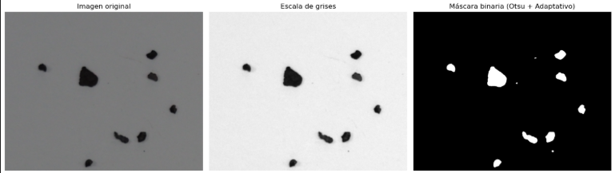
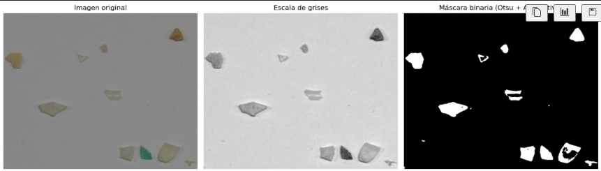
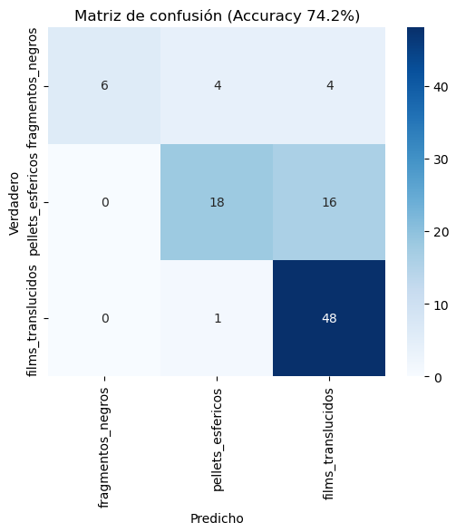

# 💰 Práctica 3 💰

## Descripción del trabajo
En esta práctica se desarrollan **dos tareas principales** orientadas al análisis de imágenes mediante técnicas de visión por computador y aprendizaje automático, empleando **OpenCV**, **NumPy**, **scikit-image** y **scikit-learn**.  

Las tareas abordan dos problemas distintos:

1. **Estimación automática de la cantidad de dinero presente en una imagen con monedas.**  
2. **Clasificación de microplásticos a partir de sus características geométricas y visuales.**

---

## Tarea 1 — Detección y valoración automática de monedas

Esta tarea tiene como objetivo **identificar y cuantificar monedas** presentes en una imagen, estimando la cantidad total de dinero.  

#### 🧩 Flujo de procesamiento
1. **Detección de monedas:**  
   - Se utiliza el detector de círculos de **Hough (`cv2.HoughCircles`)** sobre una imagen suavizada en escala de grises.  
   - Se detectan las coordenadas y radios de las posibles monedas.  

2. **Selección de referencia interactiva:**  
   - El usuario hace clic sobre una moneda conocida (por defecto, **1€**).  
   - Conociendo su diámetro real (23.25 mm), se calcula el **factor de conversión de milímetros por píxel**, que servirá para estimar el tamaño de las demás monedas.

3. **Clasificación por color:**  
   - Se transforma la imagen al espacio **HSV** y se analiza la tonalidad y saturación en el **centro y anillo** de cada moneda.  
   - Según el color predominante, las monedas se agrupan en tres categorías:
     - **Cobre:** monedas de 1, 2 y 5 céntimos.  
     - **Oro:** monedas de 10, 20 y 50 céntimos.  
     - **Bicolor:** monedas de 1€ y 2€.  

4. **Clasificación por tamaño:**  
   - A partir del valor de milímetros por píxel, se calcula el diámetro real de cada moneda.  
   - Se compara este valor con los diámetros oficiales para determinar el tipo de moneda más probable.  

5. **Cálculo del valor total y visualización:**  
   - Se suman los valores monetarios según la clasificación obtenida.  
   - Sobre la imagen se muestran:
     - El nombre de cada moneda.  
     - El contorno detectado.  
     - El **total estimado de dinero en euros.**  

#### 🖼️ Resultados
El sistema permite procesar tanto la **imagen ideal proporcionada** como **fotografías reales capturadas por el usuario**.  
En casos reales, se pueden observar errores cuando:
- Existen **solapes entre monedas**.  
- Aparecen **reflejos intensos o variaciones de iluminación**.  
- Hay **objetos no monetarios** con forma circular.  

A pesar de estas limitaciones, el método demuestra una **buena precisión** para imágenes bien iluminadas y sin solapes significativos.  

#### 📋 Ejemplo de flujo
```bash
Procesando Monedas.jpg ...
Referencia seleccionada: 1€ — Escala = 0.1264 mm/pixel
💰 Total contado: 3.88 €
```


#### ⚙️ Técnicas y librerías utilizadas
- `cv2.HoughCircles` — detección de círculos.  
- `cv2.cvtColor`, `cv2.mean`, `cv2.GaussianBlur` — análisis de color y suavizado.  
- `numpy` — operaciones numéricas.  
- Interfaz interactiva mediante **eventos de ratón en OpenCV**.  

---

## Tarea 2 — Clasificación automática de microplásticos

En esta tarea se implementa un sistema de **análisis de partículas** con el fin de identificar el tipo de microplástico presente en distintas imágenes.  

#### 🧠 Objetivo
A partir de tres conjuntos de entrenamiento (fragmentos negros, pellets esféricos y films translúcidos), el sistema **aprende patrones de forma, color y textura** para clasificar nuevas muestras de prueba (*MPs_test.jpg*).  

### **📁 Datos de entrada**

Imágenes de entrenamiento (una por clase, con múltiples instancias):


- TAR.png → fragmentos_negros  
  <br>

- PEL.png → pellets_esfericos  
  <br>

- FRA.png → films_translucidos  
  <br>

- Imagen de test: MPs_test.jpg  
  <br>

- Anotaciones de test: MPs_test_bbs.csv con columnas:

- x_min, y_min, x_max, y_max (int, píxeles)

- label en {TAR, PEL, FRA} (se mapea a las clases finales)


## **🔄 Flujo de procesamiento**

### **Preprocesado / Segmentación**
- Conversión a grises y Gaussian Blur(**`cv2.cvtColor(img, cv2.COLOR_BGR2GRAY)`** y **`cv2.GaussianBlur(gray, (5, 5), 0)`**).
- Otsu binario inverso + adaptativo(**`cv2.threshold(blur, 0, 255, cv2.THRESH_BINARY_INV + cv2.THRESH_OTSU)`**).
- Fusión (OR) para conservar detalle en zonas poco contrastadas.
- Morfología con remove_small_objects para limpiar y rellenar.
- Salida: máscara binaria.


### **Aplicación de presprocesado**

- TAR presprocesada 
  <br>

- PEL presprocesada   
  <br>

- FRA presprocesada  
  <br>


### **Extracción de características**


- Etiquetado de componentes y regionprops.

- Se descartan los objetos con area < 100.

- Para cada objeto se calculan estos aspectos:
  - *Geometría*: `area`, `circularity`, `aspect`, `extent`, `solidity`.

  - *Color HSV*: `h_mean`, `s_mean`, `v_mean`, `h_std`, `s_std`, `v_std`.

  - *Textura*: `var_intensity`, `contrast`.


### **Preparación de datos**
- Entrenamiento (prepare_training()):

  - Para cada imagen de TRAIN: segmenta → extrae features → acumula todas las filas y sus etiquetas.

  - Balanceo por downsampling: se iguala el nº de muestras por clase al mínimo encontrado (resample(..., n_samples=min_n)).

  - Devuelve X, Y balanceados.

- Test (prepare_test()):

  - Lee MPs_test_bbs.csv y mapea label → `gt_class`.

  - Por cada bbox: recorta → `segmenta` → extrae features; si no hay objetos, usa un vector nulo (1×13).

  - Promedia las features por bbox → una fila por región.

  - Devuelve `X_test`, `y_true`, `df`.


### **Ejecución**

- Entrena un RandomForestClassifier con `X_train, y_train de prepare_training()` (ya balanceados).

- Evalúa con `prepare_test()` → obtiene `X_test`, `y_true` y **predice**.

- Reajuste simple por brillo (`V de HSV`):

  - si v_mean < 85 → fragmentos_negros

  - si v_mean > 155 y era fragmentos_negros → films_translucidos

- # Resultado  
  <br>

Podemos observar que el resultado es bastante preciso siendo de un `74,2%`, siendo muy favorable y mostrando que el codigo acierta 3/4 partículas.

Guardando un csv con las predicciones resueltas.


#### 🧩 Técnicas empleadas
- **Segmentación híbrida:** Otsu + umbral adaptativo.  
- **Extracción de características:** `regionprops`, HSV y estadísticos de textura.  
- **Clasificación:** `RandomForestClassifier`.  
- **Evaluación:** `confusion_matrix`, `classification_report`, `seaborn.heatmap`.  

#### 🧪 Observaciones
El sistema muestra **alta precisión** incluso con iluminación variable. Sin embargo, puede verse afectado por:
- Partículas con **bordes irregulares o parcialmente segmentadas**.  
- Zonas con **transparencias o reflexiones** difíciles de umbralizar.  
- Desequilibrio inicial en el número de muestras por clase (compensado con resampling).  

---

## 👥 Autoría
Este trabajo ha sido realizado por:

**Pablo Medina Quintana** — Tarea 1<br>
**Suliman Hassan El Boutaybi** — Tarea 2
---

## 📚 Fuentes y referencias
Durante el desarrollo de la práctica se han consultado las siguientes fuentes:

- Documentación oficial de [OpenCV](https://docs.opencv.org/).  
- Documentación de [NumPy](https://numpy.org/doc/).  
- Documentación de [scikit-image](https://scikit-image.org/docs/stable/).  
- Documentación de [scikit-learn](https://scikit-learn.org/stable/).  
- Publicación original del trabajo [SMACC: A System for Microplastics Automatic Counting and Classification](https://doi.org/10.1109/ACCESS.2020.2970498).  
- Documentación de [Matplotlib](https://matplotlib.org/).  
- Documentación de [Seaborn](https://seaborn.pydata.org/).  

---

## 🧰 Requisitos de instalación
Para ejecutar correctamente las tareas se requiere **Python 3.8 o superior** y las siguientes librerías:

```bash
pip install numpy opencv-python scikit-image scikit-learn pandas matplotlib seaborn
```
